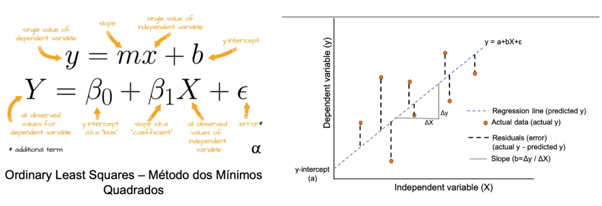

# Machine Learning | Algoritmos Supervisionados | Regressão Linear Simples



## Descrição

Esse projeto foi feito tomando como base uma plataforma de educação que consegue acompanhar a quantidade de horas que um aluno estuda em uma determinada trilha. O objetivo é identificar se a quantidade de horas de estudo influencia na pontuação do teste final dessa trilha e desenvover um modelo que consiga predizer a nota ao entrar com a quantidade de horas estudadas.

Dessa forma, foi desenvolvido um modelo de Machine Learning baseado em Algoritmos Supervisionados do tipo Regressão Linear Simples para resolver o problema.

## Etapas do projeto
1. Carga, limpeza e tratamento dos dados;
2. EDA (Exploratory Data Analysis) - Análise Explolatória dos dados;
3. Treinamento do Modelo;
4. Validação do Modelo utilizando Métricas;
5. Análise de Resíduos e conclusão geral;
6. Reaização de predições com o modelo;
7. Salvar o modelo treinado;
8. Entregar o modelo como API;

## Instruções para rodar o modelo
1. Clone o repositório
```
https://github.com/elena-calcada/modelo_machine_learning_regressao_linear_simples.git
```
2. Rode o comando
```
uvicorn api_modelo_regressao:app --reload
```
3. Acesse no seu navegador
```
http://localhost:[porta exposta no comando anterior]/docs
```
4. Teste o modelo
